<!-- 🌌 Header Animado -->

  

---

# 👋 Olá, eu sou o Plínio Peixoto

💼 Desenvolvedor Full-Stack Jr. na Blu Promotora

🎓 Estudante de Engenharia de Software e Sistemas para Internet

☁️ Apaixonado por Cloud Computing, Back-End e DevOps

💻 Experiência com Java, AWS, Linux, APIs REST, Docker e automação de infraestrutura

📍 Itaberaí, GO, Brasil

---

## 🌐 Redes

  

  

  

  

---

## 💼 Experiência

### **Desenvolvedor Full-Stack Jr. | Blu Promotora**

---

## 🧠 Tecnologias

  
  
  
  
  
  
  
  

---

## ☁️ Certificações

✅ AWS Certified Cloud Practitioner (CLF-C02)

### 📚 Próximos objetivos

- AWS Certified AI Practitioner (AIF-C01)
- AWS Certified Developer – Associate (DVA-C02)
- AWS Certified Solutions Architect – Associate (SAA-C03)

---

## 🚀 Atualmente estudando

- AWS Cloud Computing
- Docker
- Kubernetes
- Spring Boot
- GitHub Actions
- CI/CD
- Arquitetura de Microsserviços
- Arquitetura de APIs REST
- Preparação para a AWS Certified Developer – Associate (DVA-C02)

---

## 🎯 Hobbies

🎧 Escutar música

🧠 Desenvolver projetos pessoais

🎮 Jogar games

♟️ Jogar xadrez

---

## 📊 Estatísticas GitHub

  

